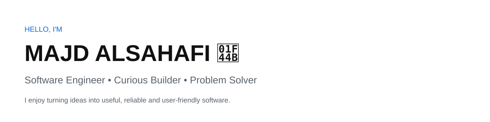
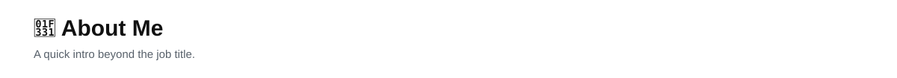
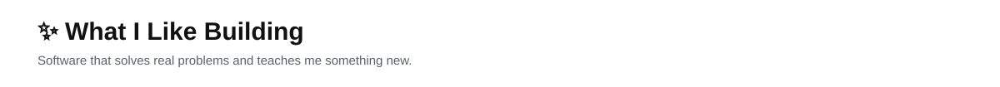
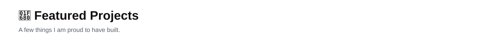
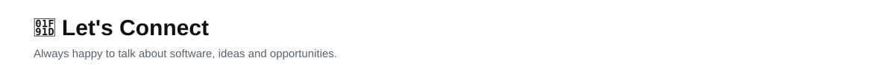

<div align="center">

<picture>
  <source media="(prefers-color-scheme: dark)" srcset="assets/dark/header.svg">
  
</picture>

<br>

<a href="https://my-portfolio-rho-navy.vercel.app/">
  
</a>
<a href="https://drive.google.com/file/d/1HIff9_C9sW1wrHdKjG7zAv_OWp-qT7jz/view?usp=sharing">
  
</a>
<a href="https://www.linkedin.com/in/majd-alsahafi-/">
  
</a>

</div>

<picture>
  <source media="(prefers-color-scheme: dark)" srcset="assets/dark/about.svg">
  
</picture>

I'm a software engineer who enjoys learning by building.

I like working across different areas of software — from **backend development and APIs** to **full-stack applications, AI, machine learning, testing and automation**.

What matters most to me is understanding the problem, building something useful, and continuously improving the way I design and write software.

- 🎯 Interested in graduate development programs and early-career software engineering opportunities
- 🧠 I enjoy problem solving, learning new technologies and working with teams
- 🛠️ I learn best by turning ideas into real projects
- 🌍 Open to different technical paths and industries
- 📚 Currently growing my skills through hands-on projects and continuous learning

<picture>
  <source media="(prefers-color-scheme: dark)" srcset="assets/dark/building.svg">
  
</picture>

```text
Ideas
  ↓
Design
  ↓
Build
  ↓
Test
  ↓
Learn
  ↓
Improve
  ↓
Ship 🚀
```

I enjoy projects involving:

- Backend systems and REST APIs
- Web and full-stack development
- AI and machine learning
- Data-driven applications
- Software testing and quality
- Automation and developer tools
- Real-world problem solving

<picture>
  <source media="(prefers-color-scheme: dark)" srcset="assets/dark/projects.svg">
  
</picture>

### 🛣️ Hazem
**AI-powered road-safety system**

A technology project focused on using artificial intelligence to support safer roads and smarter decision-making.

### 🚦 Rasid
**AI traffic-violation detection**

A computer-vision project combining AI detection with a user-facing application and cloud services.

### 🧠 Smart Traffic Violation & Risk Prediction System
**C++ + Machine Learning**

A traffic-management application that combines C++ software engineering with a Python machine-learning model for risk prediction.

### 🔄 SkillsTrade
**Peer skill-exchange platform**

A full-stack web application designed to help users share skills, discover learning opportunities and manage exchange requests.

> More projects are available across my repositories: [github.com/Majd-sud](https://github.com/Majd-sud)

<picture>
  <source media="(prefers-color-scheme: dark)" srcset="assets/dark/stack.svg">
  
</picture>

<div align="center">

**Languages**


<br><br>

**Web & Backend**


<br><br>

**Data & Databases**


<br><br>

**Engineering Tools**


</div>

<picture>
  <source media="(prefers-color-scheme: dark)" srcset="assets/dark/activity.svg">
  
</picture>

<div align="center">


<br>

<picture>
  <source
    media="(prefers-color-scheme: dark)"
    srcset="https://github-readme-activity-graph.vercel.app/graph?username=Majd-sud&bg_color=00000000&color=ffffff&line=58a6ff&point=ffffff&area=true&hide_border=true&custom_title=My%20Coding%20Journey"
  >
  
</picture>

</div>

<picture>
  <source media="(prefers-color-scheme: dark)" srcset="assets/dark/connect.svg">
  
</picture>

<div align="center">

I'm always interested in meeting people who enjoy building, learning and solving problems.

[**Portfolio**](https://my-portfolio-rho-navy.vercel.app/) •
[**LinkedIn**](https://www.linkedin.com/in/majd-alsahafi-/) •
[**GitHub**](https://github.com/Majd-sud) •
[**Resume**](https://drive.google.com/file/d/1HIff9_C9sW1wrHdKjG7zAv_OWp-qT7jz/view?usp=sharing)

<br><br>

**Thanks for stopping by! 👋**

</div>
